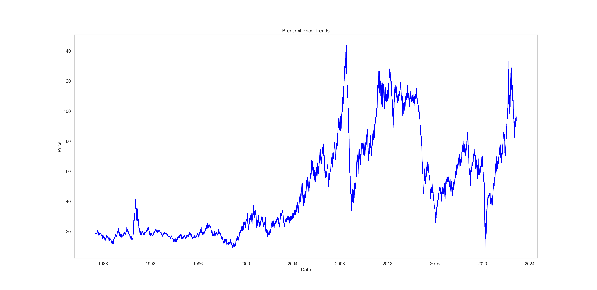

# Brent Oil Price Analysis

## Project Overview
This project aims to analyze the impact of significant political, economic, and technological events on Brent oil prices. By examining change points and applying statistical modeling techniques, the project provides insights for stakeholders, including investors, policymakers, and energy companies.

## Business Objective
Birhan Energies, a leading consultancy firm in the energy sector, seeks actionable insights into how major events influence Brent oil prices. This project assists investors, analysts, and policymakers by revealing correlations between key events and oil price fluctuations.

## Dataset
The dataset contains daily Brent oil prices from May 20, 1987, to September 30, 2022. Key fields:
- **Date**: Date of record in `day-month-year` format.
- **Price**: Brent oil price in USD per barrel.

## Learning Outcomes
This project covers:
- **Statistical Modeling**
- **Change Point Analysis**
- **Bayesian Inference using PyMC3**
- **Time Series Analysis**

## Tasks
#### Task 1: Define Data Analysis Workflow and Understand the Model
- **Objective:** Plan the analysis workflow and ensure a solid understanding of the data and statistical models.
  - Outline the steps involved in analyzing the data.
  - Familiarize with time series models (e.g., ARIMA, GARCH).
  - Identify model inputs, parameters, and limitations.

#### Task 2: Time Series Analysis and Model Application
- **Objective:** Build on foundational knowledge to analyze Brent oil prices.
  - Utilize statistical and econometric models (e.g., VAR, Markov-Switching ARIMA, LSTM) for complex pattern detection.
  - Analyze economic indicators (GDP, inflation, unemployment) and their relationship to oil prices.
  - Explore political, regulatory, and technological factors that influence oil prices.
#### Task 3: Interactive Dashboard Development
- **Objective:** Create a user-friendly dashboard to visualize analysis results.
  - Develop a Flask-based backend and a React frontend for a seamless experience.
  - Present historical trends, forecasts, and correlations with events through interactive visualizations.

## Installation
1. Clone the repository:
   ```bash
   git clone https://github.com/wastb/KIAM-Week10

2. Navigate to the project directory:
    ```bash
    cd KIAM-Week10
    ```
3. Install required packages.
  ```bash
  pip install -r requirements.txt
  ```
### Visualization

The interactive dashboard provides the following visualization features:

- **Historical Trends**: Line charts displaying historical Brent oil price trends with highlighted events.

 

- **Forecasting and Predictions**: Displayed through charts (e.g., Recharts, Chart.js) for understanding future price movements based on selected models.

